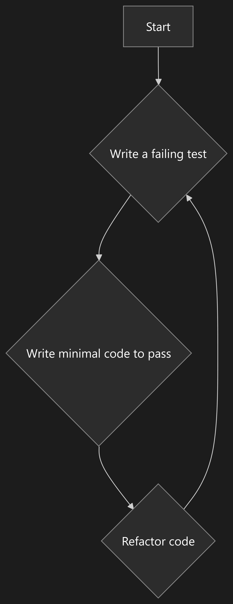
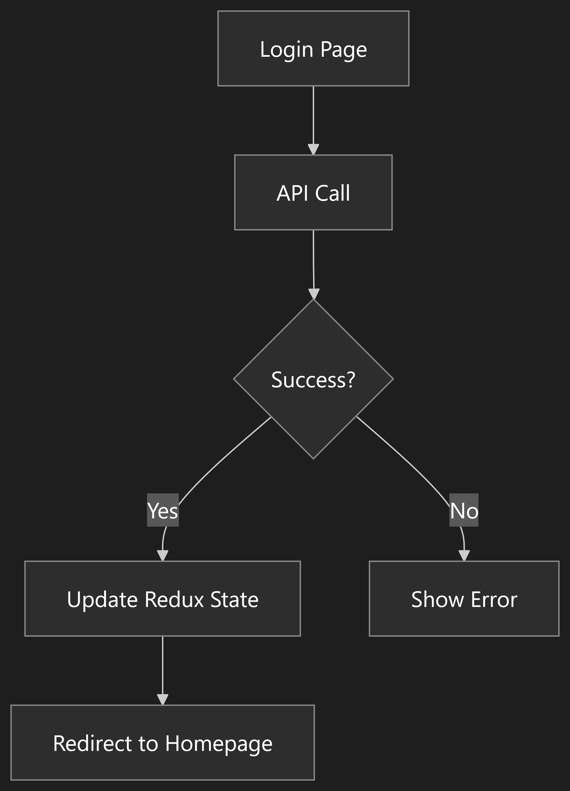
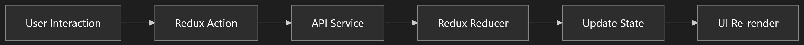

# Front-End Development: Test-Driven Development (TDD) with React, TypeScript, Vite, and Vitest


## Description

This project is a front-end application built using a strict Test-Driven Development (TDD) methodology. The primary goal is to create a scalable and maintainable codebase by writing tests before implementing any feature. This project is continuously evolving, with new features and improvements being added over time.

## Tech Stack

- **React 18 & TypeScript 5**: For building robust and type-safe user interfaces.
- **Vite 5 & Vitest 1**: For a fast development experience and an optimized testing framework.
- **Redux Toolkit 2**: For predictable state management.
- **i18next 23**: For internationalization and localization.
- **Tailwind CSS 3**: For a utility-first CSS framework.
- **Testing Library 14**: For testing React components.
- **MSW 2 (Mock Service Worker)**: For API mocking.

## Features

- **JWT Authentication Flow**: Secure user authentication and session management.
- **Redux State Management**: Centralized state management for the application.
- **Internationalization (i18n) Support**: Support for multiple languages.
- **Component Testing Library**: A comprehensive suite of tests for every component.
- **API Service Layer**: A dedicated layer for handling API requests.
- **Type-Safe Architecture**: Leveraging TypeScript for a more robust codebase.

## Project Structure

```
├── src
│   ├── assets/         # Static assets like images and fonts
│   ├── components/     # Reusable UI components developed with TDD
│   ├── locale/         # Internationalization files and configuration
│   ├── page/           # Application pages with integration tests
│   ├── services/       # API services with mock testing
│   ├── store/          # Redux slices, actions, and reducers with tests
│   ├── styles/         # Global styles and theme configuration
│   ├── tests/          # Test setup, utilities, and mocks
│   ├── types/          # Global TypeScript types and interfaces
│   └── utils/          # Shared utility functions with unit tests
```

## TDD Workflow

Our development process follows a strict TDD cycle:

1.  **Write a Failing Test**: Before writing any implementation code, we first write a test that describes the desired functionality. This test will initially fail.
2.  **Write Minimum Code to Pass**: We then write the minimum amount of code required to make the test pass.
3.  **Refactor with Confidence**: With the safety net of our tests, we can refactor the code to improve its structure and readability.
4.  **Repeat**: This cycle is repeated for every new feature and improvement.

## Testing Strategy

-   **Unit Tests**: We aim for high unit test coverage using Vitest.
-   **Component Tests**: We use Testing Library to test our React components.
-   **API Mocking**: We use MSW (Mock Service Worker) to mock API responses for our tests.

## Security Implementation

### Token Management
- **JWT Authentication**: Uses access/refresh token pattern provided by backend
- **Automatic Refresh**: Axios interceptors detect 401 errors and automatically refresh tokens
- **Storage Security**:
  - Access tokens stored in Redux state (in-memory)
  - Refresh tokens handled via secure HTTP-only cookies from backend
- **Token Handling**:
  - Frontend automatically refreshes tokens when expired (401 responses)
  - Backend controls actual token expiration times
  - No hardcoded expiration times in frontend code

### Protection Mechanisms
- Automatic token invalidation on logout (Redux state cleared, backend logout API called)
- Secure token storage in Redux state (in-memory)
- Language-aware API headers (Accept-Language)
- Authorization header management with JWT tokens

## Workflows

### TDD Development Cycle


### User Authentication Flow


### Application Data Flow


## How to Run

1.  Clone the repository:
    ```bash
    git clone https://github.com/Nikhilcs36/tdd_react_typescript_vite_vitest_project.git
    ```
2.  Navigate to the project directory:
    ```bash
    cd tdd_react_typescript_vite_vitest_project
    ```
3.  Install dependencies:
    ```bash
    npm install
    ```
4.  Start the development server:
    ```bash
    npm run dev
    ```
5.  Run tests:
    ```bash
    npm run test
    ```

## Contribution Guidelines

-   **Follow the TDD workflow**: All new features and bug fixes must be accompanied by tests.
-   **Keep components small and typed**: Ensure that components are small, reusable, and have proper type definitions.
-   **Update tests with any changes**: If you make changes to existing code, make sure to update the corresponding tests.
-   **Document complex logic**: Add comments to explain any complex logic or implementation details.

## License

This project is licensed under the [MIT License](LICENSE).
